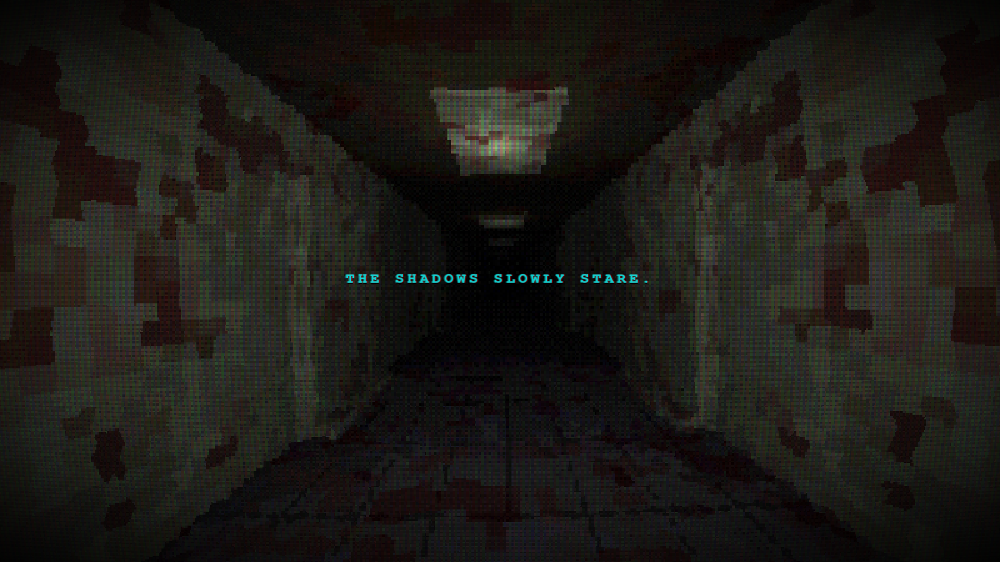

# 👁️ The Room That Breathes

> Experiencia audiovisual generativa y procedimental diseñada para evocar la nostalgia del terror retro y los "liminal spaces". Un simulador de sueño lúcido donde todo —sonido, textura y geometría— nace íntegramente del código.

[](https://ivazuara.github.io/The-Room-That-Breathes)
[](https://opensource.org/licenses/MIT)

---

## 🖼️ Preview

> 
---

## ✨ Características (Zero-Asset Policy)

- 🧠 **Raymarching Engine** — Geometría infinita y deformaciones orgánicas calculadas mediante SDFs (Signed Distance Functions).
- 🎮 **Estética PS1 Auténtica** — Simulación de hardware retro: Vertex Wobble (jitter), Affine Texture Warping y renderizado interno a 320x240.
- 🫁 **Respiración Biológica** — Ciclo respiratorio asimétrico (inhalación/exhalación) que afecta la geometría, la niebla y la intensidad de la luz.
- 🕸️ **Venas Latentes** — Texturas procedimentales de venas que se hinchan y pulsan rítmicamente bajo las paredes.
- 💭 **The Dreamer Engine** — Generador combinatorio de frases crípticas con miles de variaciones posibles.
- 🔊 **Audio Procedimental** — Síntesis de respiración humana, drones atmosféricos y pasos pesados sincronizados con el movimiento de cámara.

---

## 🛠️ Tech Stack

| Categoría       | Tecnología                          |
|-----------------|-------------------------------------|
| Entorno         | [Vite](https://vitejs.dev) + TypeScript |
| Visuales        | WebGL (Fragment Shaders / Raymarching) |
| Audio           | Web Audio API (Subtractive Synthesis) |
| Post-procesado  | Bayer Dithering 4x4 + CRT Distortion |
| Despliegue      | GitHub Pages                        |

---

## 🚀 Correrlo localmente

### Requisitos

- Node.js `>= 18`
- npm `>= 9`

### Instalación

```bash
# 1. Clona el repo
git clone https://github.com/IvAzuara/The-Room-That-Breathes.git
cd "The Room That Breathes"

# 2. Instala dependencias
npm install

# 3. Inicia el servidor de desarrollo
npm run dev
```

Abre [http://localhost:5173](http://localhost:5173) en tu navegador.

---

## 📂 Estructura del proyecto

```
The-Room-That-Breathes/
├── src/
│   ├── main.ts            # Motor principal: WebGL, Audio Engine y Dreamer Logic
│   ├── style.css          # UI, animaciones de glitch y post-procesado CSS
│   └── assets/            # Placeholders estáticos (no usados en el render core)
├── index.html             # Canvas y overlays de la interfaz
├── shader_content.txt     # Backup del código GLSL del Raymarching
├── GEMINI.md              # Documentación técnica y mandatos de diseño
├── tsconfig.json          # Configuración de TypeScript
└── package.json           # Dependencias y scripts
```

---

## 📜 Licencia

Este proyecto es una exploración técnica personal sobre síntesis procedimental. Siéntete libre de explorar el código y usarlo como base para tus propias pesadillas digitales. 🖤

---

<p align="center">
  Hecho con 🫁 y WebGL — <a href="https://ivazuara.github.io/The-Room-That-Breathes">ivazuara.github.io/The-Room-That-Breathes</a>
</p>
